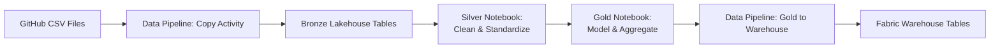
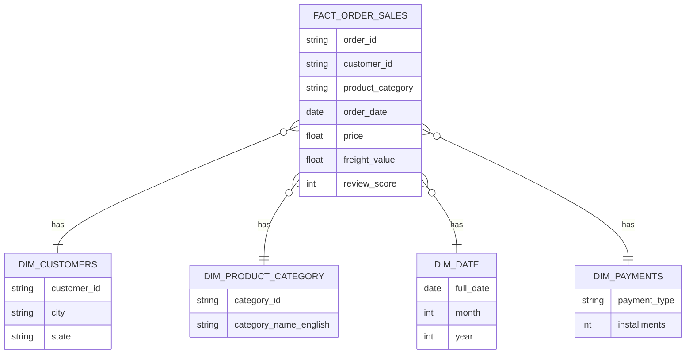

## 🗃️ Dataset Information

This project uses the **[Olist Brazilian E-Commerce Public Dataset](https://www.kaggle.com/datasets/olistbr/brazilian-ecommerce)**, consisting of six related tables:

| Dataset | Description |
|---|---|
| **Orders** | Order status, purchase, and delivery timestamps |
| **Order Items** | Products included in each order, price, and freight value |
| **Order Payments** | Payment type, installments, and payment value |
| **Order Reviews** | Customer review scores and comments |
| **Customers** | Customer ID and location details |
| **Product Category Name Translation** | Maps Portuguese category names to English |

---

## 🔄 ETL / ELT Pipeline

**Bronze:** Raw CSVs copied from GitHub into Lakehouse tables using a Fabric Data Pipeline — no transformation applied.

**Silver:** A PySpark notebook reads Bronze tables and performs:
- Duplicate removal
- Null handling
- Timestamp conversion
- Schema standardization

**Gold:** A second PySpark notebook builds business-ready, joined, and aggregated tables following a star schema, which are then loaded into the **Fabric Warehouse** via a pipeline.

---

## 🌟 Data Model (Star Schema)

---

## 📊 Power BI Dashboard

The Gold layer tables in the Warehouse are exposed through the **SQL Analytics Endpoint** and modeled into a **Semantic Model**, which powers the Power BI report.

**Dashboard highlights:**
- Total Revenue, Orders, and Average Order Value
- Monthly revenue trend
- Review score distribution
- Revenue by product category
- Payment type breakdown
- Customer distribution by state

📁 Report file: [`PowerBI/Retail_Analytics.pbip`](./PowerBI/Retail_Analytics.pbip)

---

## 📈 Key Business KPIs

- Total Revenue
- Total Orders
- Average Order Value (AOV)
- Monthly Revenue Trend
- Average Review Score
- Revenue by Product Category
- Payment Method Distribution
- Customer Distribution by Region

---

## 🧠 Skills Demonstrated

**Data Engineering:** ETL/ELT pipeline design, data ingestion, data cleaning, data transformation

**Microsoft Fabric:** Lakehouse, OneLake, Dataflow Gen2, Data Pipelines, Notebooks, Warehouse, Semantic Model

**Programming:** PySpark, Spark SQL, SQL

**Analytics:** Power BI, data modeling (star schema), dashboard design, KPI definition

---

## 🧩 Challenges & Solutions

| Challenge | Solution |
|---|---|
| Reading raw CSV data directly from GitHub | Used a Fabric Data Pipeline with a Copy Activity pointed at raw GitHub URLs |
| Inconsistent and messy source data | Applied PySpark transformations in the Silver layer (null handling, deduplication, type casting) |
| Building an analytics-ready model | Designed a Gold layer star schema before loading into the Warehouse |

## 👤 Author

**Bongoni Devendar Goud**
- GitHub: [Add your GitHub profile link]
- LinkedIn: [Add your LinkedIn profile link]
- Email: [Add your email, optional]
